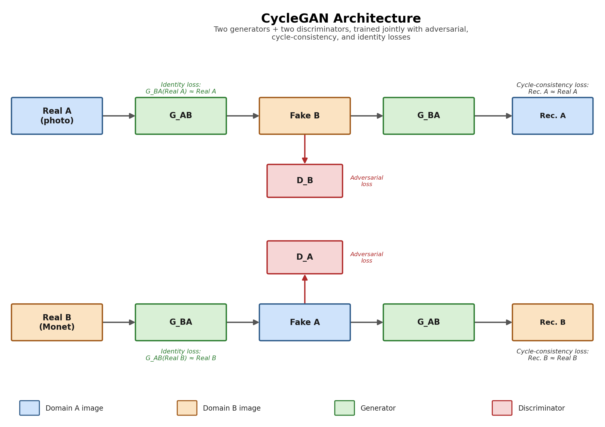
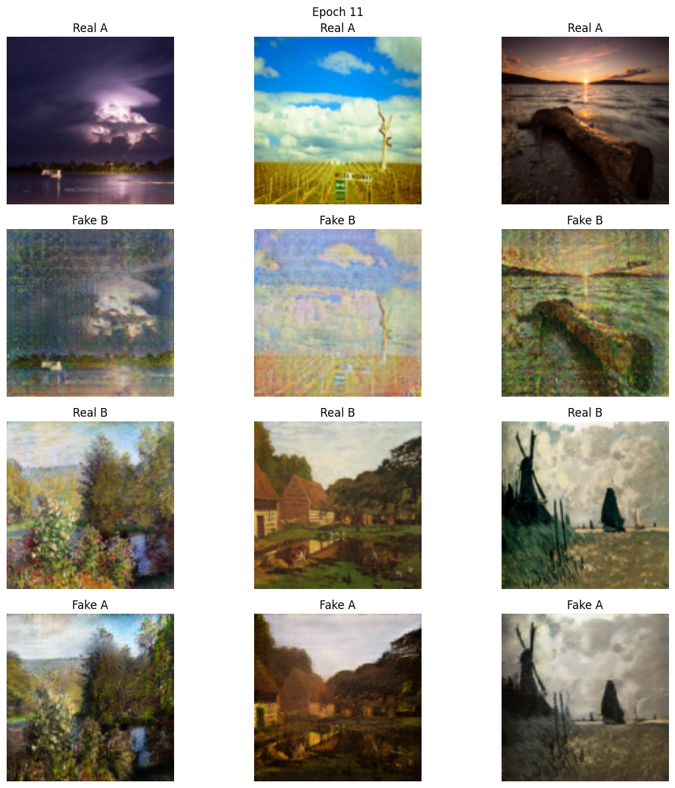

# CycleGAN-Monet-Photo-Style-Transfer 🎨


> **Results at a glance:** Trained **20 epochs** (10 constant + 10 linear decay) on a Colab
> **T4** GPU · ResNet generators + PatchGAN discriminators · Cycle-consistency + identity
> loss, 50-image replay buffer · Reduced-capacity nets (32ch/6 blocks) for fast single-GPU training

An implementation of **CycleGAN** (Zhu et al., 2017) trained from scratch on the
[monet2photo](https://www.kaggle.com/datasets/balraj98/monet2photo) dataset to translate
between real photographs and Monet-style paintings using only **unpaired** examples — no
photo needs a matching painting of the same scene. Two ResNet-style generator/discriminator
pairs are trained jointly with a cycle-consistency loss (`G_BA(G_AB(A)) ≈ A`) and an identity
loss, and the whole pipeline — dataset download, model definitions, training loop, and
inference — is self-contained in one notebook.

---

## Overview

CycleGAN learns a mapping between two image domains (here: photos and Monet paintings) using only unpaired examples from each domain — no photo needs a matching painting of the same scene. It does this with two generator/discriminator pairs trained jointly:

- **G_AB** translates domain A → domain B, **G_BA** translates domain B → domain A
- **D_A** and **D_B** try to distinguish real images in each domain from generated ones
- A **cycle-consistency loss** enforces that translating an image to the other domain and back reconstructs the original (`G_BA(G_AB(A)) ≈ A`)
- An **identity loss** encourages each generator to leave an image already in its target domain unchanged

## Architecture

<p align="center">
  
</p>

Both generators are ResNet-style encoder–decoder networks (downsample → residual blocks → upsample) with instance normalization, and both discriminators are PatchGAN classifiers that score overlapping image patches rather than the whole image at once.

This implementation uses reduced-capacity networks — 32 base channels and 6 residual blocks (vs. 64 channels / 9 blocks in the original paper) — as a deliberate accuracy/speed tradeoff so it trains reasonably quickly on a single Colab GPU at 128×128 resolution.

## Results


<p align="center">
  
</p>

Sample outputs, the loss curve, and training-progression grids are saved automatically during training to `results/` (git-ignored — see [Reproducing](#reproducing) below). After running the notebook, drop your own generated samples here, for example:

```markdown
<p align="center">
  
</p>

<p align="center">
  
</p>
```

*(Add your own screenshots once training finishes — see the "Reproducing" section below.)*

The notebook is self-contained: dataset download, model definitions, training loop, logging, and inference all live in one file, organized into numbered sections.

## Reproducing

1. Click the **Open in Colab** badge above (or open `notebooks/cyclegan_monet2photo.ipynb` directly in Google Colab).
2. Set the runtime to a GPU (**Runtime → Change runtime type → T4 GPU** or better).
3. Run all cells top to bottom. The notebook will:
   - Install dependencies and download the `monet2photo` dataset via `kagglehub`
   - Train `G_AB`, `G_BA`, `D_A`, `D_B` for the configured number of epochs
   - Save a comparison grid and a model checkpoint periodically
   - Plot loss curves and let you run inference on a new image at the end

All hyperparameters (epochs, batch size, learning rate, loss weights, checkpoint frequency, etc.) are set in a single `CONFIG` dictionary near the top of the notebook.

### Local setup (alternative to Colab)

Open `notebooks/cyclegan_monet2photo.ipynb` in Jupyter. Training is significantly slower without a CUDA GPU.

## Training Details

| | |
|---|---|
| Dataset | [monet2photo](https://www.kaggle.com/datasets/balraj98/monet2photo) (Monet paintings ↔ photographs) |
| Image size | 128×128 |
| Batch size | 1 (standard for InstanceNorm-based CycleGAN) |
| Epochs | 20 (10 constant LR + 10 linear decay to 0) |
| Optimizer | Adam (lr=2e-4, β1=0.5, β2=0.999) |
| Loss weights | cycle ×10, identity ×5 |
| Replay buffer | 50 previously generated images per domain, used for discriminator updates |
| Hardware | Google Colab T4 GPU |

## Limitations & Future Work

- **Fixed hyperparameters, no CLI** — everything is configured through the notebook's `CONFIG` dict rather than command-line arguments; fine for experimentation, less convenient for automated sweeps.
- **No held-out validation set** — the model is evaluated only qualitatively on training-domain images; a proper split would allow tracking generalization.
- **No quantitative metrics** — adding FID or a similar distributional metric would make it possible to compare checkpoints or runs objectively rather than by eye.
- **Lower resolution / reduced capacity** — trained at 128×128 with a lighter network than the original paper (256×256, more channels, 9 residual blocks) as a compute tradeoff; results would likely improve with the full-size architecture given more GPU budget.
- **No resume-from-checkpoint path** — if training is interrupted, it currently restarts from scratch rather than continuing from the last saved checkpoint.

## Acknowledgements

- Zhu, J.-Y., Park, T., Isola, P., & Efros, A. A. (2017). *Unpaired Image-to-Image Translation using Cycle-Consistent Adversarial Networks*. [arXiv:1703.10593](https://arxiv.org/abs/1703.10593)
- Dataset: [balraj98/monet2photo](https://www.kaggle.com/datasets/balraj98/monet2photo) on Kaggle

## License

This project is licensed under the [MIT License](LICENSE).
